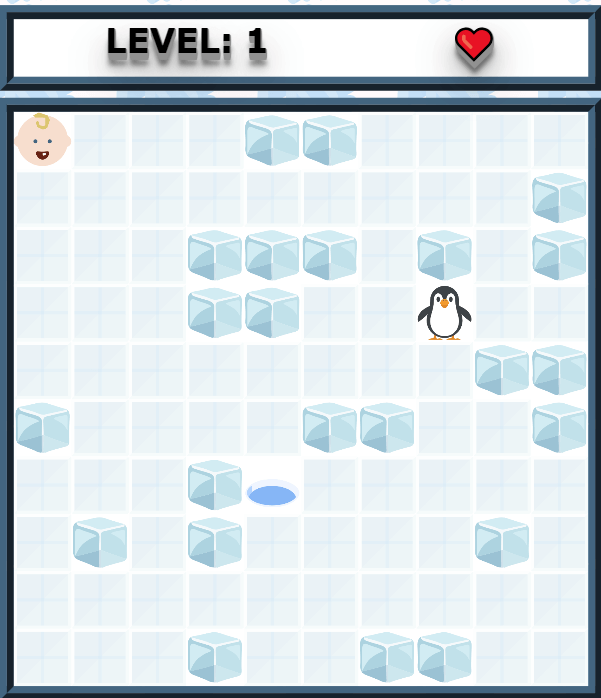

# Boos
A simple P5 game

Play it online [here](https://hendrikras.itch.io/daphnes-game)




This game is based on an JAVA applet authored by Jan Verhoeven and included as an example in the book "Toepassingen in Java" (ISBN: 9789039514603).

It has been ported to JavaScript and P5. Furthermore a winter theme has been added.

## Development
install http-server locally:
``````
 npm i
 ``````

start the local server
``````
npm start
``````

navigate your favorite browser to: http://localhost:8080/index.html

That's it, no bundler! Just edit the ES6 classes as they are.